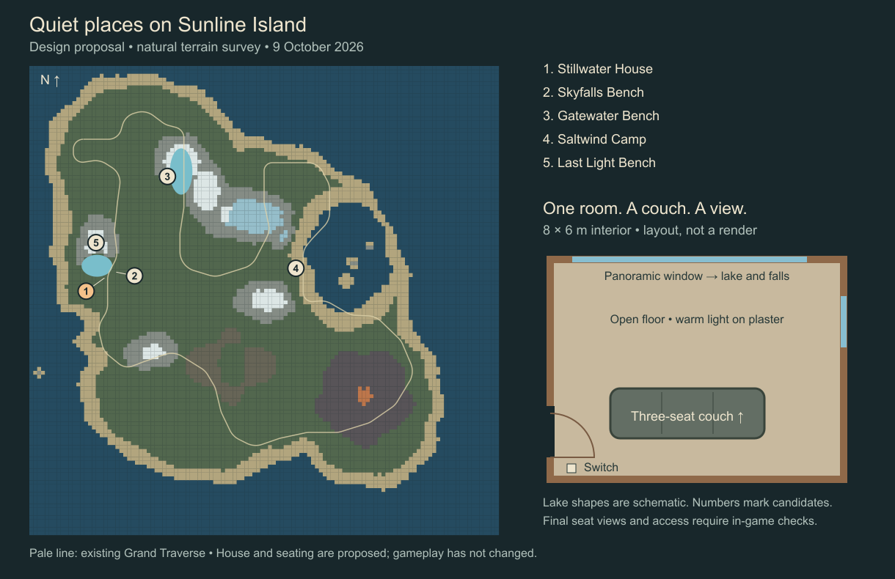

# Quiet places on Sunline Island

Design proposal, 9 October 2026. Planning and survey artifacts only; gameplay has not been implemented.

## The experience

Add four deliberately placed outdoor gathering spots and one small, beautifully
textured house. Walk there together, sit beside each other, watch the water or
the sunset, and stay as long as you like. In the house, flick a physical wall
switch and watch warm light reveal the plaster, timber grain and couch fabric.
The existing Commons campfire remains the easy gathering place near arrival.

These places have no task, countdown, upkeep requirement, reward or forced
camera sequence. The interaction is the experience. Keep the island spacious:
each spot earns its location through its view, shelter and atmosphere.

## Placement proposal

Coordinates use simulation X/Y horizontal and Z up; 12 units equal one metre.
Renderer axes use X/Z horizontal and Y up. Candidates were selected by sampling
the current terrain, then checking footprints, lake sightlines and separation
from the compiled Grand Traverse and authored ruins. Measurements below refer
to a fresh island. Deck elevations are preliminary.

| Place | Candidate X / Y / deck Z | What goes here | Reason and remaining placement work |
| --- | --- | --- | --- |
| **Stillwater House** | 7680 / 21696 / 1320 | One room, three-seat couch, large picture window, side window, physical light switch, small porch | A level sampled 8 × 6 m footprint above the southern Skyfalls basin. Clear sampled seated ray to the lake centre. About 27 m from the railway centreline and 128 m in a straight line from Skyfalls Shore station. Final window rotation, falls visibility, paths and train noise need review. |
| **Skyfalls Bench** | 8884 / 21100 / 904 | One two-seat timber bench on a small supported terrace | Clear sampled seated lake-centre ray, about 54 m from the railway centreline. Face across the basin toward the cascades. The footprint spans a terrain step; use a small supported deck and walkable approach, then verify the actual waterfalls from both seats. |
| **Gatewater Bench** | 14116 / 11308 / 840 | Two seats together on the western bank, with no lamp or fire | A flat sampled bank within the World Gate cavity, looking across the glacial lake under the enormous vault. Clear sampled ray to the lake centre; about 140 m from the railway centreline. Use the arch's cavity floor, not the mountain-top height. Validate voxel support and a continuous shore path. |
| **Saltwind Camp** | 27248 / 20704 / 200 | One low stone fire ring and five seats, including an adjacent pair | A modest coastal clearing south of the Tidal Sanctum, about 63 m from the railway and 47 m from the nearest authored ruin footprint. Aim the seating toward the bay and sea stacks; exact ocean sightlines remain unsurveyed. Keep the fire out of the paired seats' main view. |
| **Last Light Bench** | 6816 / 18080 / 4672 | Two two-seat benches facing different horizons on the proposed summit terrace | Shares the destination already proposed in the Skyfalls freight-gondola plan. Terrain horizons are approximately −4.8° at the game's dawn bearing and −7.2° at dusk from the preliminary seated eye height. This depends on a supported summit terrace; coordinate with the gondola layout and reserve views clear of its terminal. |

**Build the house first**, then the two lake benches and Saltwind Camp. Add Last
Light when the summit terrace and usable access are resolved. The house and
first three spots do not depend on implementing the gondola.

The house footprint is promising, but rotating it to frame the falls can change
its support requirements. Survey the rotated shell, porch, stairs and exit
zones before locking it. The path from Skyfalls Shore climbs roughly 60 m;
provide a gentle switchback route rather than assuming the straight-line walk
is usable. Allow a few minutes for this approach. Give every other spot a
continuous ground route or make its transport requirement clear on the atlas.

The existing gondola proposal is in
[skyfalls-freight-gondola-plan.md](skyfalls-freight-gondola-plan.md). Place Last
Light seating beside the terminal, with its machinery behind the views.

### What the survey proves

[Survey JSON](../artifacts/chill-spots/survey.json) records the sampled footprints,
rail/ruin distances, lake rays and summit horizon angles.
[Survey script](../tools/chill-spots-survey.ts) regenerates the JSON and map with
`npx tsx tools/chill-spots-survey.ts`. The lake rays use the fresh volumetric
terrain, so the World Gate's opening is included.

The survey does **not** prove the full panorama is clear. It excludes vegetation,
player saves, detailed station envelopes, water/falls presentation, local paths,
future furniture and transport machinery. The lake ellipses on the diagram are
schematic. Final placement must be judged in first person from every seat, not
from an aerial camera. Move a spot within its candidate area if the actual view
or access is better; never bury existing player construction to force a location.

## Stillwater House

Use a small alpine house with a low pitched roof, deep timber window reveals,
dark exterior boards and a sheltered entrance. Keep the silhouette quiet so it
belongs to the landscape. A short porch links it to the path; its window should
be a warm, inviting rectangle when seen from outside at night.

Inside, allow approximately **8 × 6 m** of usable floor and a 2.7–3 m ceiling.
The room contains one generous three-seat couch facing the view. Leave open
floor for the rest of a five-person crew. No kitchen, bedroom, storage system,
furniture collection or television in this first version. A concealed ceiling
light and one restrained wall fixture are part of the architecture.

The large picture window frames water, mountain and the falls if the final view
allows it. A smaller side window adds daylight from another direction. Give the
windows proper frames and thick reveals, with a few mullions placed away from
the central seated view. Make the glass only faintly reflective so the scenery
stays legible. Use a real doorway, solid roof/walls and consistent interior
collision. An open entry is sufficient initially; a toggleable door is optional
follow-up work.

The palette is warm off-white plaster, honey-brown oak flooring, one dark timber
accent, and a muted moss/stone couch. Texture scale, joinery and lighting do the
decorating. Small bevels catch the light on the couch, switch plate, sill and
timber trim. A soft normal map should reveal the walls' surface without making
them look like rock.

## Real texture shortlist

These specific sources were checked on 9 October 2026. Use their actual PBR
texture maps, with the following artistic treatment. All are Poly Haven CC0
assets; the official [license](https://polyhaven.com/license) permits commercial
use and redistribution of the assets. Source links below are references, not
evidence that texture files have already been imported.

| Surface | Selected texture | Treatment in the house |
| --- | --- | --- |
| Interior walls and ceiling | [White Plaster 02](https://polyhaven.com/a/white_plaster_02) | Warm ivory tint; restrained normal strength. Let grazing light show subtle unevenness. Keep the ceiling a touch lighter. |
| Floor | [Wood Floor](https://polyhaven.com/a/wood_floor) | Warm oak boards with real grain and satin roughness. Align boards along the room's long axis; do not stretch one square image across the floor. |
| Exterior, window reveals and small interior timber accent | [Wood Plank Wall](https://polyhaven.com/a/wood_plank_wall) | Dark varnished boards. Reduce the dominance of weathering indoors; reserve the fuller worn character for exterior surfaces. |
| Couch upholstery | [Poly Wool Herringbone](https://polyhaven.com/a/poly_wool_herringbone) | Fine woven surface, tinted gently toward muted moss or warm stone. The source is grey; colour treatment is an art choice. Small-scale normal detail, high roughness and restrained fabric sheen. |

The existing `WoodFloor051` and `Rock030` ambientCG maps can support outdoor
benches and fire rings. The house gets the curated materials above. The earlier
`Fabric Pattern 07` candidate is too visibly checkered for this calm palette;
use the subtler herringbone weave.

### Import and material requirements

- Bundle chosen maps locally under `public/textures/friends-retreat/`, with a
  source/license README and a manifest of filenames, authors, native physical
  scale, download date and any recolouring. No runtime texture website requests.
- Start with **2K colour, OpenGL normal and roughness** for plaster and floor;
  **1K–2K** for boards and upholstery, judging the result at seated distance.
  Use the provider's physical scale metadata for UV repeats. Reserve 4K for a
  demonstrable close-up improvement after profiling.
- Colour maps use sRGB; normal, roughness and occlusion remain linear. Preserve
  detail under the current day/night exposure. Do not bake a bright room light
  into the colour map, because it would remain visible with the switch off.
- Use shared texture objects, mipmaps and supported anisotropy. Optional packed
  occlusion/roughness maps must preserve the intended channels. Geometry gives
  the large shapes; do not use heavy displacement to create walls or flooring.
- Budget roughly 40–70 MiB of additional resident texture memory for the initial
  material set, depending on actual resolutions and formats. Measure GPU memory
  and decode/arrival hitches, then compress or reduce maps if necessary. JPEG
  transfer size is not the GPU memory cost.
- Inspect the actual textures together before import is considered final. Reject
  visible tiling, oversized fabric weave, glossy plaster and mismatched wood
  colours. Capture room close-ups with lights both on and off.

## The light switch is the small toy

Put a visible rocker switch beside the entry, at comfortable reach. Aim at it
and press the existing **F/interact** binding: `Lights on` or `Lights off`.
Controller and touch use the same action. The rocker moves immediately, a small
positional click plays, and the room changes over about 120–180 ms. It must
respond to separate clicks without a long cooldown or a held key oscillating.

**On:** approximately 2700 K warm light washes the ceiling and plaster, makes
the oak grain visible and pools gently around the couch. Keep gentle contact
shadows beneath the couch and within window reveals. The view stays readable
through the glass. Warm window spill makes the house inviting from outside.

**Off:** all switched fixtures, their emissive surfaces and their artificial
bounce contribution go dark. Daylight or moonlight still enters through the
windows. At night, retain cool sky light on the sill and soft shapes in the room,
with meaningful contrast against the warm on state. Flashlights and night vision
continue to work. Day/night exposure is shared with the world; the switch must
not brighten the entire island or change another player's exposure.

Start with one nearby shadowed spotlight aimed at the main room surfaces and a
small number of bounded, non-shadowed fills or precomputed indirect-light masks.
Use local room material treatment so the exterior hemisphere/ambient light does
not illuminate closed walls as if they were outdoors. Any baked artificial
bounce must be controlled by the switch. Daylight needs to be bounded to window
openings, not emitted through solid walls. Validate these choices in the actual
renderer; beautiful darkness is a release requirement.

Allocate lights once and change contribution while toggling. The project already
uses stable light layouts for day/night and culls inactive contributions. Avoid
scene-wide shader recompilation on every click. Limit shadows to the nearby
room and freeze/update the shadow cache appropriately for motion or switch
changes. Restrict fog inside the room using local material/interior logic,
without removing the distant outdoor haze visible through the windows.

## Sitting together and campfires

Every bench has **two independently claimable adjacent seats**, both facing the
same view. The couch has three. Let players look around freely, including at
each other. F or jump stands up into a collision-checked clear area; do not
place an exit over the cliff or inside furniture. Seat orientation only supplies
the initial view. Standing players keep normal movement around seated friends.

Use a natural seated pose for remote avatars with believable legs and hand
placement. The current campfire uses a crouched actor state; generalisation
must include presentation work so a couch sitter does not look like a crouching
operator embedded in a cushion. Hide intrusive first-person tools during a
passive sit, and restore them on standing. Campfire roasting remains a distinct
active interaction.

Saltwind's five seats include a close pair sharing the ocean view and space for
the rest of the crew. Use a small flame, a few embers, gentle local light and
quiet positional crackle. Keep a comfortable baseline flame without requiring
players to fetch wood to enjoy the spot. Optional fuel/roasting can reuse the
current campfire behaviour. Neither the house nor a bench starts roasting UI.
Keep strong fire glow, smoke and overhead fixtures outside primary view sectors.

Reduce exterior wind and distant transport noise inside the house. Preserve a
soft sense of water and the outdoors; do not introduce a compulsory music loop.
Check that waterfall volume allows a conversation at the couch and Skyfalls
bench. Discovery can add a small atlas marker; it should not interrupt sitting
with a reward banner.

## Implementation shape

The current implementation has a single fixed Commons campfire, eight seat
positions keyed to `commons-campfire`, one campfire snapshot/fuel save, and
separate Grand Traverse seating. Reuse the successful interaction behaviour,
but remove singleton assumptions deliberately.

| Area | Planned work |
| --- | --- |
| Authored locations | Add a `FriendsRetreatSites` definition with stable site IDs, seat transforms, interaction bounds, foundations, approach/exit areas and view sectors. Keep the natural terrain generation intact. |
| Seating | Introduce shared static seat lookup/claim logic. Preserve train seating and Commons campfire IDs. Audit every `friendsSeat` consumer: train snapshots currently treat non-campfire seats as train seats, and combat/tool handling has campfire-specific exceptions. Explicit seat kind/capabilities must distinguish a bench, couch, fire and train. |
| Campfires | Generalise fire simulation, renderer, proximity audio, fuel and roast ownership by fire ID. Preserve the existing Commons fuel during save migration. A roast belongs to the fire where its player is seated. Select/mix nearby audio with a bounded voice count. |
| House | Add authored geometry, matching fine-scale collision and roof/overhead checks, shared PBR materials, window glass, switch target and bounded room lighting. The 32-unit terrain voxel grid is too coarse for thin interior walls and a switch; use authored meshes and colliders. |
| Multiplayer | Host owns seat claims and room switch state. Validate interaction distance and line of sight on the host; send distinct action IDs so resends do not toggle twice. All guests can sit and toggle regardless of building permission. Same-frame seat requests resolve to one occupant; competing toggles resolve consistently in host order. |
| Save and replication | Persist `roomLights` by stable room ID, defaulting Stillwater to on for a new island. Preserve the chosen state across reload/late join, including an off state. Treat occupancy as live session state and clear it on departure. Add versioned schema fields through the existing Friends world/motion replication boundary and migration path. |
| Terrain/save coexistence | Check existing builds and edited terrain before materialising authored foundations. Skip or relocate a conflicting new site deterministically with host authority; never overwrite player work. Reserve only the necessary house/seat support area against accidental excavation, with a clear tool message. |
| Presentation | Extend `FriendsFrontierVisuals`, interaction prompts, avatar pose, `FriendsMap` and location audio. Discovered destinations stay quietly available on the atlas. |

## Build order and acceptance

1. **Room art prototype.** Import the four selected materials; build the shell,
   couch, two windows and switch. Preview noon, golden hour and moonlit night.
   Get the room's light-on/light-off contrast and close-up materials right.
2. **House placement and approach.** Validate rotated footprint, lake/falls views,
   porch and a walkable station path on the current world. Test exterior window
   glow and train noise from the couch. Move the candidate if this improves it.
3. **Shared interactions.** Add static seats, host-authoritative switching,
   collision-safe exits, save migration and late-join state. Audit carry/pilot,
   teleport, death, reconnect and movement-prediction interactions.
4. **Three outdoor spots.** Place the two lake benches and Saltwind fire, checking
   every occupied seat view and the physical walk there. Generalise campfires
   before adding the second fire; preserve Commons roasting and train seating.
5. **Summit destination.** Resolve its supported terrace and access alongside
   the gondola proposal. Verify sunrise and sunset with seats occupied and all
   terminal machinery present.
6. **Finish and verify.** Tune textures, audio and lighting, then record evidence
   from the house and every seat with two clients and a full five-player crew.

Required checks for implementation:

- Two friends can occupy adjacent bench/couch seats, turn toward each other,
  stand safely and sit again. Simultaneous claims never share a seat. Departure,
  jump, death, carry and teleport cannot leave a ghost occupant.
- Toggling from either client produces the same room state for everyone. A
  duplicate action packet cannot invert the state again. Rapid distinct clicks
  remain responsive. Late join and reload recover the current on/off state.
- Noon, dusk and night screenshots from the couch, entry and outside prove the
  view and material palette work. Off has no artificial fixture/bounce glow;
  on has no wall leakage, burnt-out plaster or opaque-looking windows.
- Existing saves retain player builds, edits and Commons fuel. A conflicting
  save cannot have construction overwritten by the new house.
- Campfire roasting, train seats, flashlights, night vision, aircraft and player
  carrying continue working. Guests with exploration-only access can chill.
- Compare local frame times, draw calls, texture memory and shadow updates with
  room lights on/off and a full crew. Target no shader compilation on toggles,
  no more than one nearby room shadow map, and less than 10% median frame-time
  regression in matched views. Investigate slower frames rather than hiding
  them with distant-only measurements.

Run the relevant meaningful unit/integration checks plus the repository's
required type/build checks when implementing. This planning change only runs
the read-only survey and verifies its diagram; it does not claim gameplay tests.
