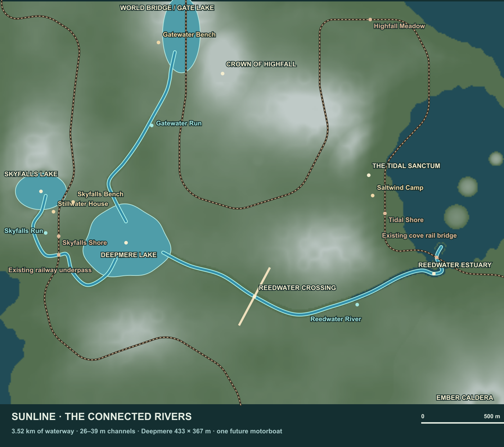

# The connected rivers of Sunline Island

Implemented 9 October 2026. This document replaces the earlier broad single-river proposal. Skyfalls Lake and the lake beneath the World Bridge / World Gate now feed a new deep inland lake, Deepmere. Reedwater carries its outflow to the eastern sea. The network uses narrower channels, lively current patterns and wooded gorge scenery. The next vehicle remains **one shared motorboat**.

## Placement and scale

Coordinates are simulation X/Y horizontal and Z up. There are 12 game units per metre. The render engine uses X/Z horizontal and Y up. The survey is generated directly from the implemented centreline and terrain, using `node_modules/.bin/tsx tools/river-survey.ts`.

| Waterway | Connection | Length | Width | Minimum still-water depth in central 24 m lane |
|---|---|---:|---:|---:|
| Skyfalls Run | Skyfalls Lake → Deepmere | 854 m | 26–33 m | 4.88 m |
| Gatewater Run | World Bridge lake → Deepmere | 981 m | 26–32 m | 5.79 m |
| Reedwater River | Deepmere → eastern sea | 1,687 m | 30–39 m | 4.63 m |

The complete branching network contains **3.52 km of river**. It is one connected body of water through Deepmere, rather than a single 3.52 km straight route. Deepmere's nominal footprint is **433 × 367 m**, with an irregular shoreline, submerged shelves and a deepest floor **47.5 m** below its surface. Its centre is `(12128, 23600)`, surface datum `154.5`, and deepest terrain datum `-416`. The terrain floor remains `-512`, leaving solid substrate below the lake.

Skyfalls Run leaves the southern basin, winds west of Stillwater House, crosses beneath the existing raised railway span, wraps around the southern ridge and enters Deepmere's southwest shore. Gatewater Run exits the World Gate lake to the southwest, passes west of the castle's reserved grounds and joins Deepmere from the north. Reedwater exits the eastern shore, swings southeast through a long valley, passes beneath a new stone arch and reaches the sea below the existing cove railway bridge.

The water descends continuously through smooth elevation transitions. Source reaches stay level with their existing lakes; all three channel endpoints finish at the receiving lake or sea datum. There are no vertical drops, dams, locks or centre-channel piers. The steepest tributary rapids reach about **14% and 17% slope**; Reedwater's steepest reach is about **2.8%**. These are wild tributaries: the future boat needs motor assistance and slope-aware buoyancy to travel upstream.

## Preserved places and crossings

Rail alignment, station elevations, ordinary pier foundations, tower bases, mountain bores and platform geometry remain in their existing locations. The terrain generator reserves a 320-unit envelope around the railway. Skyfalls Run deliberately uses the opening between the existing piers at railway chainages `123904` and `124416`, centred near `(8000, 24348)`. Water there is at `442.5`, below the rail's `594` deck datum and the lowest truss at approximately `522`: about **6.6 m of air clearance** before accounting for the small wave crest.

At the eastern cove, the boat passage uses the existing suspension span. A narrowly bounded exception deepens already submerged seabed in the central passage. It never raises terrain, grades a rail approach or cuts a tower footing. The tower foundation keep-outs extend 192 units from the adjacent bases. This removes a shallow terrace that otherwise prevented the promised boating depth.

The World Gate river modifies the **cavity floor** separately from the mountain's roof. The vault and castle stay intact. The castle and complete ascent, Sanctum, arrival, mines, campfire, hauling pads, retreat buildings and retreat approach paths are reserved against river carving. The river curves around those reservations. New water footprints clear procedural forest placement and add wet-soil climate beside the channel. Existing terrain save generation stays at 4; loading the change does not discard player edits or builds. Player work can still intentionally alter terrain outside protected masonry and transit volumes.

## Reedwater Crossing

The new crossing is centred at `(20000, 26900)`. Its angle follows the local valley normal, and its deck is at datum `608`. It has an **80 m stone span**, a **10 m-wide deck**, stone parapets and two **128 m stepped approaches** connecting the deck to the hillsides. Twin arch ribs leave the river's centre open. Bank-side abutments sit outside the boat lane.

A single authored box set controls the visible masonry, walkable floors, ceilings, parapet and abutment collision, terrain clearance, tool ray hits and digging protection. The render geometry merges that box set into **two material batches**. There are 470 boxes / 5,640 triangles for the complete bridge and approaches. Collision queries use spatial buckets. The approach grades clear underlying voxel columns so an invisible terrain face cannot obstruct the visible treads.

This crossing is a pedestrian landscape feature. It is not a new railway segment. Both existing railway bridges remain available overhead on the water route.

## Water, atmosphere and movement

The river uses thin, terrain-masked ribbon meshes grouped into 2,048-unit tiles. The existing bathymetric water shader provides depth colour, shallow-water fade, shoreline foam, sun and sky response. River attributes add downstream ripple drift and moving whitewater streaks. Tributaries use stronger foam and waves than the main river. Their maximum displacement is approximately 0.29 m; the main river uses about 0.20 m. Foam patterns flow while the river geometry and shoreline coordinates remain fixed.

Matching lake planes own the flat source and receiving reaches, avoiding duplicate transparent water at lake connections. The ocean owns the flat estuary. Deep inland water suppresses the ocean plane beneath it, even when the lakebed lies below sea level. Water materials participate in the existing day/night lighting. River ambience reuses the waterfall loop with a softer, spatially attenuated mix, so the implementation adds no audio files or new dedicated audio voices.

The player movement controller now swims in deep frontier water. Players float without input, swim in their viewing direction, sprint-swim, drift gently downstream and jump to climb out. Jet and slide state clear on entering swimming; fuel recharges. Walkable terrain, built floors and vehicle decks retain priority over water buoyancy. Host simulation and local prediction run the same controller. No new replicated swimming field or protocol version is required. Water footsteps use the same bounded wet footprint as swimming.

Survey flags for the water destinations stand on the shore or bridge parapet, leaving the channel clear. Landmark discovery uses the water or deck elevation, so a swimming player can discover Deepmere without diving to its lakebed.

The in-game map draws both tributaries, the main river and all three lakes. Deepmere Lake, Reedwater Crossing and Reedwater Estuary are named destinations alongside existing landmarks.

## Performance approach

No fluid solver, per-wave physics body, reflection render target or new downloaded visual asset is introduced. Terrain, vegetation, meshing workers, navigation samples, audio and movement share deterministic fields. River queries use 512-unit spatial buckets. Render tiles allow normal frustum culling, and every depth mask is generated once at construction.

Automated rendering checks bound the added river and bridge geometry to **fewer than 22,000 triangles**, at most **32 water draw batches plus two bridge batches**, and less than **2 MiB of river depth-mask storage**. The bridge meshes reuse the existing stone material and textures. The new lake uses the existing lake shader and its standard 160×160 depth mask. The browser inventory measured **19,680 triangles**, **26 river batches plus two bridge batches**, and **958,464 bytes (0.91 MiB)** of depth masks. These are structural budgets; whole-world FPS also depends on terrain, forest streaming, camera placement and the user's GPU.

The browser review records actual draw counts, triangle counts, frame timings and streamed terrain readiness in `artifacts/river-implementation/render-checks.json`. Frame timings from an automated browser are observations of that machine, not a guarantee for all hardware.

## Verification and next boat

Regression tests sample every compiled centreline point across five lateral positions covering the central 24 m lane. They check continuous water, minimum depth, monotonic descent, source and receiving datums, preserved foundations and retreat approaches, the World Gate roof, every bridge approach tread, parapets, under-arch passage, ray hits, digging protection, swimming recovery, solid-deck priority and equivalent split prediction ticks. Water tests verify ocean masking and geometry/texture limits. Existing beach checks continue to cover the natural coastline outside the intentionally dredged estuary.

The browser review tool is `/tools/river-review.html` on the development server. Its buttons show Deepmere, Skyfalls, the railway underpass, the World Gate, Gatewater rapids, the stone bridge from land and water, the lower gorge and the estuary, with day/dusk/night controls. Run `node tools/test-friends-rivers.mjs` for reproducible screenshots and WebGL/error checks.

The next implementation should add **one shared motorboat**, approximately **12 × 4 m or smaller**, with a draft no greater than **1.5 m** and air draft no greater than **4 m**. This fits the surveyed lane and railway underpass with margin, including the bounded waves. Derive water level, current direction and slope from the shared water/river samplers. A boat must respect real terrain, supports, players and builds; the depth survey does not substitute for its future swept-hull collision tests. Start in a sheltered Deepmere cove, allow the crew to board together, and support upstream return through the rapids. The vehicle, dock, seats and controls are the next step and are not included in this landscape change.

Validation recorded on 9 October 2026: TypeScript and the production build passed. The complete 180-file suite covered 1,472 tests; two tests exceeded their wall-clock limits while the browser review was running and passed in the subsequent focused rerun. All ten review viewpoints, dusk and night screenshots, and WebGL/browser error checks passed. The build retains Vite’s existing large-bundle advisory. See `artifacts/river-implementation/validation.json` and the rendering reports for the exact scope.
