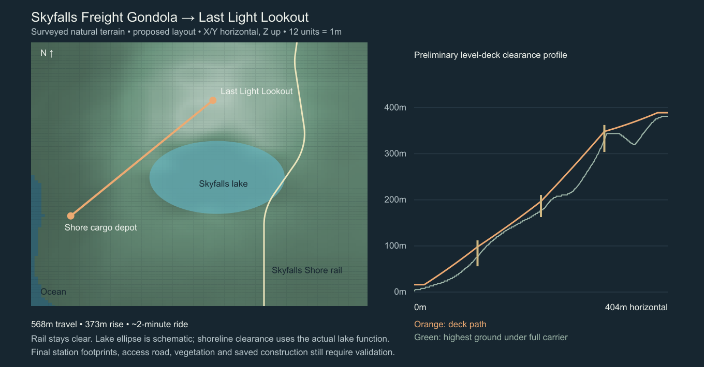

# Skyfalls Freight Gondola / Last Light Lookout

Planning proposal, 8 October 2026. No gameplay implementation in this change.

## Decision

Build one fixed, reversible freight gondola from a new shoreline depot west of
Skyfalls to a high lookout on the western massif. It carries large physical loads
and a small crew together. The destination is a useful mountaintop workshop and
a quiet place to sit with friends, facing both sunrise and sunset.

This adds an uphill connection the lowland Grand Traverse does not provide. Keep
the existing railway, castle ascent, World Gate flight passage and hauling
missions intact. Start with one excellent route; a player-authored lift network
is a separate later project.

## Surveyed location

Survey uses the current natural terrain, authored ruins, actual sampled railway
and solar orbit. Coordinates use simulation X/Y horizontal and Z up; 12 native
units equal one metre. Renderer coordinates are X/Z horizontal and Y up.

| Element | Proposed world position / measured result |
| --- | --- |
| Lower terminal centre | X 3520, Y 21632; ground Z 32; preliminary deck Z 192 |
| Upper terminal centre | X 6816, Y 18080; ground Z 4576; preliminary deck Z 4672 |
| Upper viewing deck | About 389 m in world elevation, 403 m above sea level |
| Horizontal separation | 403.8 m |
| Deck elevation gain | 373.3 m |
| Preliminary cable path | 568.0 m, including the support profile |
| Nearest railway centreline | 167.2 m from the proposed lift centreline |
| Nearest authored ruin box | 877.3 m from the proposed lift centreline |
| Natural terrain below full carrier | At least 6.07 m in the sampled profile |
| Lake clearance | Full lateral sweep stays outside the modelled lake boundary; minimum distorted lake radius 1.113 |

The lower terminal sits inland of the western shoreline. Skyfalls Shore railway
station is at X 8000, Y 23200: approximately 396 m away in a straight line. Reserve
an **approximately 500–700 m service path around the lake's southern side** as a
design allowance, then survey its actual length, grades and loading access. The
lift is a western branch of the railway destination, rather than another
structure on its boarding platform. A broad cargo path is a required part of the
feature; an isolated lift with no usable approach would defeat the hauling goal.

The route runs along the western mountain shoulder. It avoids the main waterfall
face, the lake interior and the eastern railway alignment. Leave the falls and
the World Gate as natural landmarks. Put foundations on land; avoid a new bridge
through the hanging lake.

### Why this destination

The survey found a natural summit at Z 4576, approximately 381 m. From the proposed
viewing height, the terrain horizon is below the sun's horizon direction at both
dawn and dusk. The game's dawn direction is toward +X/-Y (northeast on the atlas),
and dusk toward -X/+Y (southwest). This follows `FriendsDayNight.ts`, rather than
assuming a generic east/west sun path.

The dawn ray passes toward Highfall and the World Gate; sunset faces the western
ocean. The lake and cascade valley provide foreground scenery. The authored
24-real-minute day means dawn/dusk recur often enough for casual sessions.

These are **terrain sightline checks**, not a guarantee that every bench is clear:
trees, terminal roofs, towers and the full solar disc still need in-engine checks.
Keep a clear viewing sector around each horizon bearing. The cable descends in
the southwest sector, so the upper terminal needs careful placement behind/beside
the seating terrace. Never put a bullwheel housing between seated eyes and sunset.

### Comparison with other locations

| Candidate | Decision |
| --- | --- |
| Western Skyfalls summit | Preferred: ocean sunset, clear surveyed dawn direction, water/lake foreground and a useful steep ascent |
| Highfall castle / World Gate | Preserve the existing fortress, winding hauling approach and flight passage; infrastructure here would compete with major landmarks |
| Eastern glacier ridge | Attractive alternative, but no comparable clearance/approach survey has been completed; less direct western-ocean foreground |
| Ember Caldera | Strong spectacle; volcanic terrain and smoke make it a weaker first quiet sunrise/sunset destination |
| Directly above spawn | Convenient, but a large loading yard and overhead carrier would occupy the core arrival/building space |

## Rope haul mechanism

Use a **single reversible aerial tramway**: one large carrier travels up and down
the same lane and stops completely at both ends.

Two fixed track ropes support a wheeled trolley. A separate moving haul-rope loop
pulls the trolley. The lower terminal houses the motor, gearbox, drive bullwheel
and brake; the upper terminal houses the return sheave and a guided tensioning
carriage. Both ends of each track rope have visible anchored saddles/foundations.
Route the haul return strand through its own tower rollers, clear of the cargo
and boarding envelope. At reversal, cable texture motion, trolley wheels and the
drive bullwheel reverse together. Sheave rotation follows travelled cable length.

This mechanism has real freight precedent: [Doppelmayr's reversible tramways](https://www.doppelmayr.com/en/systems/reversible-aerial-tramways/)
use stationary track ropes and haul-rope propulsion; [its material ropeways](https://www.doppelmayr.com/en/systems/material-ropeways/)
include systems for unit loads and combined passenger/freight transport. The game
proposal is a visual/mechanical interpretation, not a real-world engineering design.

Avoid a continuous procession of small cabins: it adds vehicles, loading logic,
passenger reservations, overlapping approaches and idle motion without helping
the oversized-cargo use case. A second counter-running carrier is a later capacity
upgrade only if actual play proves that waiting matters.

### Support profile

A straight interpolation between the decks would penetrate the mountain by up to
**44.35 m beneath the full level carrier**. Towers are essential.

| Support | X / Y | Track-rope height above local ground |
| --- | --- | --- |
| Lower approach gantry | 3652 / 21490 | About 27 m |
| Tower 1 | 4344 / 20744 | About 56 m |
| Tower 2 | 5168 / 19856 | About 48 m |
| Tower 3 | 5992 / 18968 | About 59 m |
| Upper approach gantry | 6684 / 18222 | About 43 m |

These are preliminary support heights. Terminal approach gantries can form part
of their founded approach structures. Use braced steel frames with real saddles,
anchored bases and inspection platforms. Avoid thin decorative poles supporting
an enormous carrier. Keep tower legs outside the swept cargo envelope, including
the deck corners while crossing a saddle.

The survey uses 2 m maximum parabolic sag on travelling spans and a 14 m
track-to-floor offset. Final rope shape uses a cached smooth curve with blended
saddle transitions, an arc-length lookup and no abrupt trolley slope changes.
Resurvey after smoothing: the current piecewise profile proves a plausible
clearance envelope, not a finished ride curve. Profile changes and larger sag
must never silently reduce clearance.

## The carrier and large cargo

| Specification | Initial design target |
| --- | --- |
| Entire level floor | 18 m long × 12 m wide |
| Cargo loading envelope | 14 m long × 7 m wide × 8 m high |
| Track-to-floor offset | 14 m |
| Passenger accommodation | Two protected side galleries; eight seats total, subject to existing room limits |
| Gameplay load rating | Up to 20 tonnes equivalent; calibrated game weight, not cannon-es mass units |
| Moving cargo groups | Up to four secured groups; one group may occupy the full bay |
| Assembled building payload | Up to 64 pieces total across all groups initially, within the existing global building limit |

The 8 m height matches existing Grand Traverse freight clearance, making this
useful for the same freight without a new arbitrary ceiling. The carrier is
wider than the train; a load that fits the gondola need not fit a railway wagon.

Keep the central bay open above cargo height. An overhead trolley/yoke is still
required; this is a tall loading envelope, not unlimited sky clearance. Use end
gates, retractable level loading bridges, side tie-down rails and four corner
attachment fittings. Passenger galleries have separate rails and doors, kept
outside the cargo box. Cargo geometry must not block the galleries or controls.

The floor remains level throughout the journey. Trolley wheels follow cable
tangent; the hanging carrier has stable upright orientation. Tiny cosmetic sway
can affect a yoke/trim mesh, but not the authoritative walkable floor, cargo pose
or first-person camera. No compulsory camera rocking.

### Supported loads

Support the existing salvage cores, transportable resource pallets/crates and
player-assembled structures/machines within the bounds. Existing movable core
physics alone does not implement the other two categories; portable groups need
an explicit payload type and ownership/reference rules.

All corners and collision boxes of a group must fit the rotated cargo envelope.
Require support on the deck, no world-foundation attachment, no passenger overlap
and no remaining external hauling ropes. Show the offending size/weight/attachment
when rejecting a load. Never treat disconnected world builds as a movable group
just because their bounding boxes touch.

Players pull/push a physical core onto the level dock using the existing launcher.
F near cargo secures/releases it only while docked. Assembled freight can be built
on a transport pallet and loaded as one bounded group; its constituent pieces
retain IDs, materials and local transforms. Departure requires every load to be
secured. Store secured freight in carrier-local coordinates, suspend its active
rigid-body simulation, and transfer it back to ground collision on release.

Free-swinging crane loads and arbitrary dangling ropes are outside the initial
scope. They would require a different clearance volume and much more physics.
The huge stable deck is the initial oversized-load solution.

## Terminals and the destination

### Shore freight depot

Reserve a roughly 44 × 28 m founded terminal, plus a clear apron and the surveyed
service approach. Separate the walking path from the loading bridge. Include a
timber passenger shelter, two benches, restrained destination sign, cargo outline
painted on the deck, call button and an operator panel. The drive machinery is
visible behind a guard, giving the rope haul mechanism a believable source.

Use a compact pier/retaining structure following the shore slope, not a large
flattened rectangle. Station footprint elevations are not yet surveyed; the
carrier dock's Z 192 is provisional and can rise if the final terminal requires
it. Recompute the complete profile when changing a deck elevation.

### Last Light Lookout

Organize three connected spaces: the upper freight terminal, a workshop/storage
apron and an open viewing terrace. Place the machinery on the incoming side,
with a short accessible walkway leading around it to the terrace. Unloaded cargo
goes to the workshop apron, keeping the social space clear.

Target a 20 × 14 m terrace with seating for eight, sunrise and sunset bench
clusters, an open central gathering space and a small warm-lit shelter behind
the benches. Low transparent/open railings protect edges without making a wall
across seated views. Add a low stone hearth using emissive flame and restrained
near-only effects. Keep lights recessed and low so nighttime stargazing works.

The terrace needs no purchase, resource consumption or timed activity to sit
and enjoy the view. No loud announcements, looping machinery audio or required
quest UI. A cargo workshop and the ability to construct a personal outpost give
freight a purpose after the first sightseeing trip.

Use mineral concrete/stone footings, subdued green steel, timber and weathered
zinc to match the Grand Traverse. Foundation columns and cantilevers reach real
terrain. Avoid hovering platforms or a giant artificial summit plateau. Survey
the entire upper campus footprint before fixing its shape; this drawing reserves
a destination concept, not a verified 50 m flat summit.

Existing voice/chat facilities remain independent of the lift. The shared scenic
space supports conversation; this feature does not add a new voice service.

## Player flow and operating rules

1. Arrive at Skyfalls Shore; follow the marked service trail to the shore depot.
2. Call the carrier. A call from the other end dispatches it if empty/unclaimed;
   an occupied docked carrier shows a pending call and lets riders depart first.
3. Move cargo across the level loading bridge, secure it and board the gallery.
4. F at the operator panel opens Depart / Hold / Return to dock controls. Show
   payload fit, gate state, pending call and ETA only where useful.
5. Departure closes gates and retracts bridges after checking their sweep is clear.
6. Rise at a nominal 5 m/s with gentle acceleration/braking; allow about 2–2.5
   minutes including ramps and docking. The 114-second number is cruise-only.
7. Latch at the upper dock, deploy the bridge, then open boarding/loading gates.
8. Release freight onto the workshop apron; walk to the terrace and sit/look around.

Keep the service demand-driven: no empty endless cycling. While friends are on the
summit, a carrier parked below is available through the upper call button. Queue
calls deterministically and collapse duplicates. A docked idle carrier can be
recalled after a short grace period if there are no onboard players or unsecured
loads. Any living rider can operate it with the game's normal transport access;
only one accepted command is needed, never conflicting simultaneous departures.

State flow: `docked → closing → travelling → braking → latching → docked`.
`held`/`blocked` retain progress and attachments. A hold in midair allows resume or
return to the last dock, keeping doors closed. A disconnect never detaches cargo
or abandons the last rider. External obstructions request braking with the whole
carrier hull and braking horizon, rather than testing its centre after impact.

Walking riders use the moving support frame and inherited platform velocity.
Seats have free look. Jumping detaches cleanly; existing flight tools continue to
work. Gameplay physics uses the same level deck transform as the visual and local
prediction. Do not attach a rider to a tilted cable tangent.

## Space protection and coexistence

Protect actual station structure volumes, tower foundations and a narrow 3D
carrier/cable corridor with a 2 m lateral margin. Avoid a tall ground-to-sky
no-build stripe under the entire route. Construction and excavation below it
remain possible when they do not undermine protected footings or enter clearance.

Use the full swept carrier (length, width, yoke and load height), terminal gate
sweeps, approach gantries and braking horizon. Preserve rail/platform reservations,
ruins, castle approaches, cave mouths, water boundaries and existing aircraft
access. Remove/relocate only vegetation that actually intersects the final sweep;
avoid clear-cutting the route for visibility.

Before enabling in an existing save, validate saved builds and terrain edits.
Existing work takes priority: do not delete it or regenerate the world. If no
minor adjustment fits, leave the lift disabled and show a specific conflicting
location. Newly imported obstruction makes the lift hold. Survey final footpaths
so they never require walking on track or through a loaded cargo bay.

## Performance design and budgets

**Expected to be affordable; not free and not measured yet.** Visible static
infrastructure has render/memory cost even while parked. Offscreen draw culling
does not automatically remove shadow draws, physics or network work. At a summit,
the widened terrain/forest/ocean view may cost more than the lift itself, so
compare the same camera with and without the feature.

### Simulation

One route parameter drives the entire carrier. Precompute cable shape, tangents,
arc-length lookup, support transforms and collision reservations once per route
revision. No simulated cable particles, per-strand constraints or tower rigid
bodies. Represent immovable structure collision with cached simple boxes/prisms.

The existing host fixed-step clock handles moving service state. Parked service
is event-driven; unregister active motion work rather than adding a fresh timer.
Secured load groups follow local transforms with no cannon-es steps. Unsecured
loading cargo uses existing near-cargo simulation, and resting cargo sleeps.
Freight group count/complexity has a hard cap. Motion does not remesh terrain or
rebuild cargo collider regions every frame.

### Rendering and streaming

Batch station/tower components by material and spatial tile, following
`FriendsStaticBatch.ts`; instance repeated rollers, bolts and rail posts. Keep
separate span bounds so a whole ropeway does not remain visible because one end
is onscreen. Compute instance bounds after setup; [Three.js InstancedMesh docs](https://threejs.org/docs/pages/InstancedMesh.html)
describe bounding spheres used for culling.

Ropes are cached low-poly tube/strip geometry. Haul texture phase animates instead
of rebuilding vertices. Near-only trolley wheels/sheaves rotate from distance.
Use a near carrier, simplified medium carrier and tiny distant silhouette; cull
detail and shadow casting independently. Never add a dedicated gondola camera,
reflection renderer or shadow map. Use existing celestial lighting/shadows.

Re-use materials/textures. No station video screens or transparent glass walls
across the panorama. Warm fixtures are emissive; at most one local light enters
the existing bounded light pool, with no extra shadow map. Audio is distance
culled and stops completely when parked.

Prefetch only around active riders and the next braking/arrival region. Stage
approaching terminal collision before opening gates. Summit silhouettes can use
existing horizon/forest LOD; don't hold both terminal regions at maximum detail
for the entire session. Rendering a stopped offscreen carrier is unnecessary;
its authoritative occupied trip still finishes even when nobody sees it.

### Multiplayer

Host owns progress, speed, state, docking/gate status, cargo groups and seat claims.
Transmit route ID/hash, sequence, host time, progress and velocity at the existing
motion cadence (target 10–20 Hz nearby), and reconstruct locally using the cached
route. Freight local transforms are durable deltas, not all vertices or 64 world
transforms on every snapshot. A mid-route late join receives attachments and
motion together. Reliable commands are deduplicated and proximity/access checked.

Far viewers receive a coarser service state; occupied riders and both terminals
remain relevant across travel. Parked state changes need an event, not a new
per-frame lift packet; existing periodic full snapshots may still contain its
small summary. Don't move/simulate cargo independently on each client.

### Provisional acceptance targets

| Measured condition | Target / maximum incremental work |
| --- | --- |
| Parked, fully offscreen, outside shadow range | No dedicated motion steps, rope/cargo solver work, draw calls or recurring lift packets; small bounded cached state remains |
| Parked, visible close-up | ≤20 added main-view draws, ≤50k visible triangles for infrastructure/carrier, excluding player freight |
| Travelling with four loads/eight riders | ≤0.25 ms p95 added host service/attachment work per host tick |
| Near visible feature | ≤0.5 ms p95 added client CPU work; ≤1.0 ms incremental GPU time on the agreed reference desktop |
| Freight representation | ≤64 pieces total, ≤4 groups; separately report their draw/triangle costs |
| Shared asset/cache growth | Target ≤8 MiB incremental geometry/textures; measure CPU and GPU memory separately |
| Nearby motion network cost | Target ≤2 KiB/s added per relevant client, excluding players' existing motion and occasional cargo deltas; measure encoded/wire size |

These are engineering gates, **not achieved benchmark results**. Record reference
hardware, browser, resolution and graphics settings before deciding whether they
are feasible. Add service timers/counters to the existing opt-in performance
monitor and capture GPU timings where supported. Measure main/shadow passes,
p50/p95 frame times, allocation/GC and peak arrival streaming spikes.

Compare identical scenes with the feature disabled/enabled: distant spawn, near
parked depot, empty trip, maximum freight/crew, sunrise/sunset terrace and train
or aircraft in the same view. Also run a ten-minute inactive test and repeated
world reloads to catch retained listeners/geometries. If baseline already misses
frame budget, the gondola budget cannot make the total scene acceptable.

## Implementation boundaries in this repository

| Proposed module / integration | Responsibility |
| --- | --- |
| New `FriendsGondolaRoute.ts` | Units contract, endpoints, support geometry, smooth route compilation, deterministic arc-length sampling and route hash |
| New `FriendsGondolaInfrastructure.ts` | Exact founded station/tower collision, gate volumes and 3D build/excavation reservations |
| New `FriendsGondolaService.ts` | Host motion controller, calls, permissions, dock/gate state and rider attachment |
| New `FriendsTransportPayload.ts` | Shared bounded cargo groups, carrier capability/envelope and local attachment transforms |
| New `FriendsGondolaVisuals.ts` | Spatial batches, rope spans, distance-derived rollers, LOD, bounded lights/audio and disposal |
| `FriendsExpedition.ts` / `CoopSimulation.ts` | Own/delegate the service through the existing Friends lifecycle and host clock |
| `FriendsHauling.ts` / `FriendsCargoPhysics.ts` | Secure/release using carrier capabilities; suppress solver work only while attached; preserve full world orientation on release |
| `FriendsBuilding.ts` | Generalize the current `grand-N`/scenic-wagon attachment validation for explicitly supported transport surfaces and payload groups |
| `FriendsVehiclePose.ts` / player movement / prediction | Shared upright support frame, walking/seat motion, inherited velocity and collision |
| `protocol.ts` / replication / interest / presentation timeline | Versioned compact motion, durable attachment deltas, late joins and identical render-time sampling |
| `FriendsTerrain.ts` / build validators | Volume-based reservations and final-save obstruction audit; no landscape generation version bump |
| `FriendsWorldStorage.ts` | Optional versioned service configuration/cargo; old saves remain loadable |
| `FriendsMap.tsx` / HUD / new compact controls | Route/destination marker, boarding/call prompts and panel; no new keybinding conflict |

Reuse the existing train attachment/pose concepts, not its rail curvature model:
the carrier must remain upright and has a different envelope. Currently build
attachments are hard-coded to scenic wagon IDs, and physical hauling cargo is a
fixed-size core; these are explicit implementation tasks, not already supported
general freight APIs. The existing physics adapter uses 32-unit solver scaling
while display metres use 12 units, so the new weight rating needs a documented
conversion/calibration rather than guessing kilogram values from core mass.

Fresh worlds can start with this authored public lift assembled, like the touring
train, so the scenic visit is available immediately. Adventure lets crews build
the depot/outpost around it. A resource-gated lift construction project and a
general player-designed ropeway editor are optional future progression, not
required to access this first social destination.

Persistent player freight remains attached in local coordinates across save/load.
On a full world reload, park the service at its last successfully latched terminal
and apply all retained attachments there; don't restore an uncontrolled in-air
journey. Late joining a live session restores its actual current journey instead.
Existing salvage missions retain their fresh-session reset contract. Do not
carry their completion/straps across a new game just because the lift has saves.

## Delivery sequence and verification

1. **Finalize the site.** Survey final station/terrace/apron footprints, service
   trail, full tower/yoke geometry, vegetation and saved construction. Compile
   smooth cable saddles, full swept hull and stopping horizon. Check dawn/dusk
   from seated eye level with actual buildings and shadows. Stop this phase only
   when the destination is walkable and the road can carry the promised freight.
2. **Prove the journey.** Build a greybox with one deterministic shuttle, both
   terminals, gate/bridge sequencing, calls, seats and walking riders. Verify host
   and guest correction, late join and a complete return journey. Benchmark empty
   motion and inactive service before investing in decorative detail.
3. **Prove big freight.** Carry one existing core, then a 14×7×8 m bounding payload,
   then a 64-piece pallet group. Test every gate, tower saddle, stopping condition,
   unload, save/restore and return trip. Check no item duplication/loss, no attach
   teleport, no external ropes on departure and no cargo/player overlap.
4. **Finish the shared place.** Build the apron, terrace and shelter using the
   final foundations. Add materials, restrained lighting/audio, signs and atlas
   integration. Inspect from walking, seated, aircraft and train views.
5. **Meet the performance gates.** Benchmark the full maximum-load journey and
   dawn/dusk hangout, including low graphics settings, shadow cost and streaming
   transitions. Tune LOD/batches/freight caps if needed; retain a disable toggle
   for comparison and compatibility recovery.

Required meaningful automated checks cover deterministic route sampling, smooth
saddle pose/velocity, full cargo/yoke swept clearance, railway/ruin exclusion,
construction/terrain reservations, attachment frames, inherited rider motion,
duplicate/unauthorized commands, late joins and save migration. Add integration
checks for different game modes so a Friends-only lift cannot affect combat.
Visual review covers sunset/sunrise views and believable support geometry;
performance captures establish the budgets. Finish with TypeScript, production
build and the relevant existing rail, hauling, movement, replication and save
regressions. Do not claim final implementation validation from the planning scan.

## Planning artifacts and limitations

`tools/gondola-survey.ts` can regenerate the natural-terrain measurements and
route/profile graphic with `npx tsx tools/gondola-survey.ts`. Machine-readable
results are in `artifacts/gondola/survey.json`; the full sample arrays are retained
for later design comparison. The current scan samples the complete upright
carrier footprint at 513 route positions, including a 2 m lateral reserve, and
looks along dawn/dusk terrain rays to 40,000 native units.

No browser save, saved terrain edits, dynamic trees, final foundation boxes,
loading aprons or approach-road profile were audited. The profile is piecewise
parabolic and needs smooth final saddle curves. The lake ellipse in the graphic
is schematic; the numeric lake clearance uses the actual distorted lake function.
Towers/terminal envelopes and panoramic sectors need their own final checks.
No runtime performance claim has been measured, and gameplay is unchanged.
